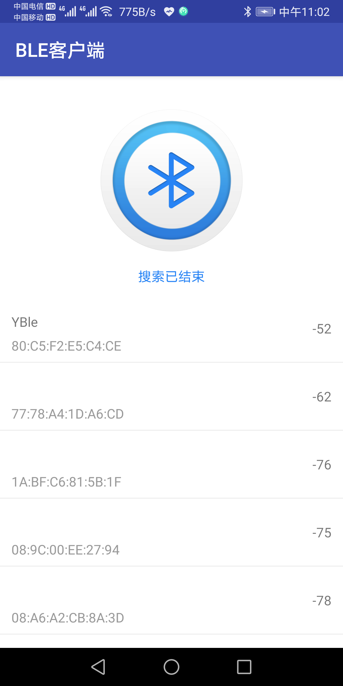
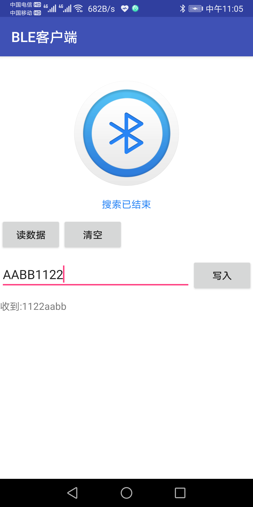
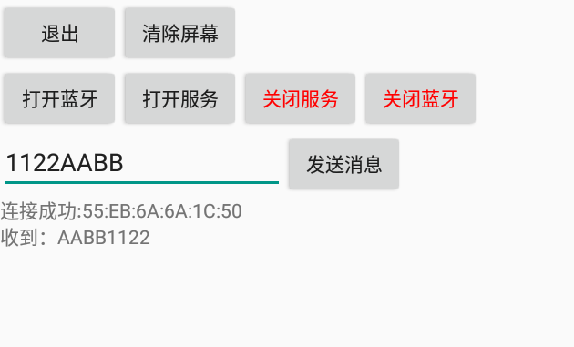

# 蓝牙BLE客户端

实现BLE搜索，BLE连接，BLE发送数据。  
服务端地址：https://github.com/yutils/yutils/tree/master/app/src/main/java/com/yujing/test/activity/bluetooth  

## 开发环境准备
**推荐使用jetBrains Toolbox 中的android studio，并更新到最新正式版**  

【必须】打开AS的安装目录，在bin目录下找到这两个文件（studio.exe.vmoptions，studio64.exe.vmoptions）  
在其中最后一行添加	-Dfile.encoding=UTF-8   
```bat
安装目录位置
C:\Users\用户名\AppData\Local\JetBrains\Toolbox\apps\AndroidStudio\ch-0\版本\bin
如：
C:\Users\yujing\AppData\Local\JetBrains\Toolbox\apps\AndroidStudio\ch-0\211.7628.21.2111.8139111\bin
```

## 截图


|              搜索               |              发送               |
| :-----------------------------: | :-----------------------------: |
|  |  |

**服务**  
  


